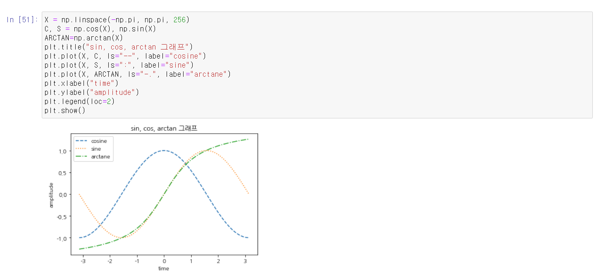
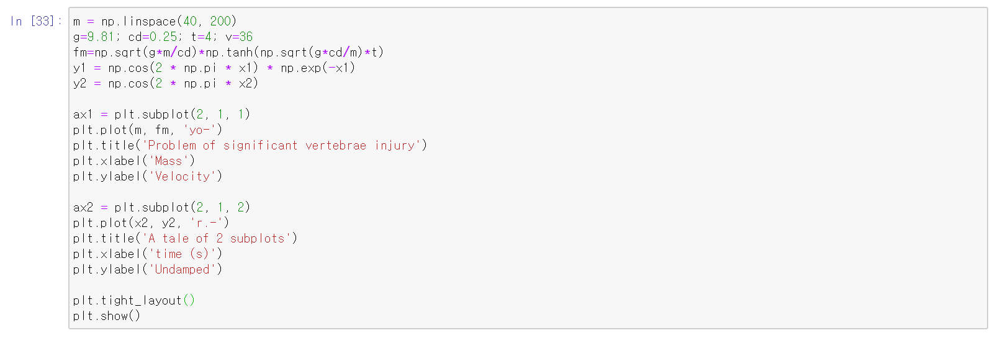
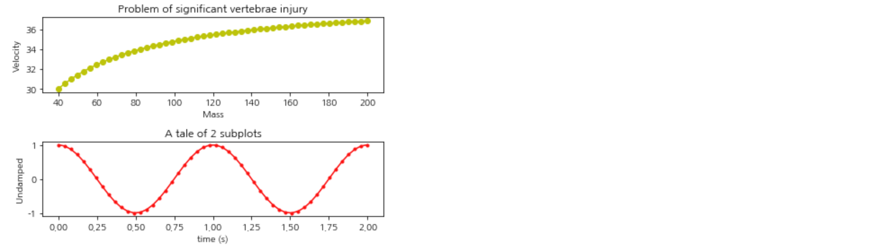
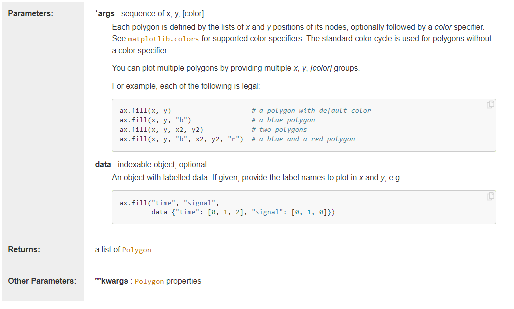
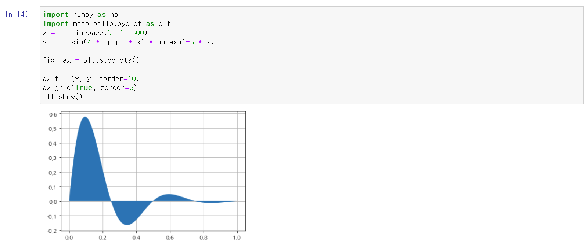
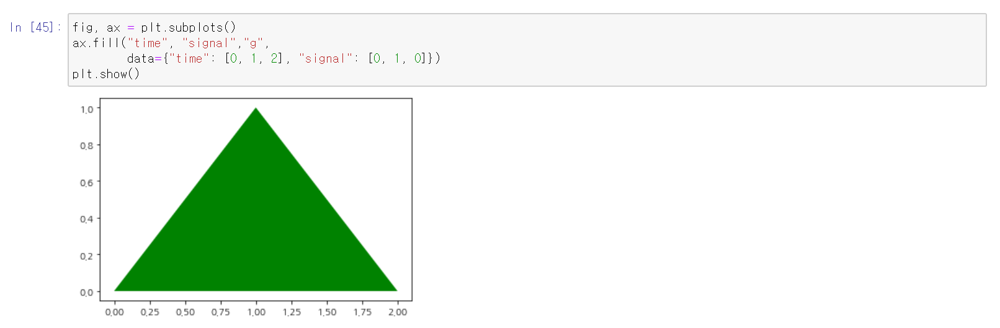

# 수치해석 과제 20171622 박건후

### 소감 

- [x] mathplolib의 기본 사용법을 숙지할 수 있었습니다. 

- [x] 그래프의 다양한 형태를 나타내는 코드를 작성함으로써 그래프를 어떻게 표현할지 생각할 수 있었습니다. 

- [x] Matplotlib API의 다양성을 통해 그래프를 겹쳐서 나타내는 방법, grid 표현 방법을 알게 되었습니다.

- [x] 앞으로 수치해석이란 과목을 들을 때 쉽게 그래프를 작성할 수 있을 것이라는 자신감을 얻었습니다.

#### 연습 문제 1[¶](https://datascienceschool.net/view-notebook/d0b1637803754bb083b5722c9f2209d0/#연습-문제-1)

여러가지 함수를 사용하여 아래 조건에 맞는 그래프를 그린다.

- xlabel, ylabel, title을 모두 갖추고 있어야 한다.
- 하나의 Figure(일단, 그림이라고 이해한다. 아래에 자세한 설명이 있다.)에 3개 이상의 Plot을 그린다.
- 각 Plot은 다른 선, 마크, 색 스타일을 가진다.
- legend는 그래프와 겹치지 않는 곳에 위치 시키도록 한다.

#### 연습 문제 2[¶](https://datascienceschool.net/view-notebook/d0b1637803754bb083b5722c9f2209d0/#연습-문제-2)

여러가지 함수를 사용하여 위와 같이 subplot들로 구성된 그림을 그려보자. 모든 subplot에 대해 xlabel, ylabel, title이 있어야 한다.

#### 연습 문제 3[¶](https://datascienceschool.net/view-notebook/d0b1637803754bb083b5722c9f2209d0/#연습-문제-3)

1. Matplotlib 갤러리 웹사이트에서 관심있는 예제 코드를 하나 고른다.
   - http://matplotlib.org/gallery.html
2. 예제 코드에 사용된 Matplotlib API 명령의 목록을 만들고 Matplotlib 웹사이트에서 관련 링크를 찾아 내용을 정리한다.
3. 변형된 형태의 플롯을 만들어본다.

## 연습 문제3

### matplotlib.axes.Axes.fill

