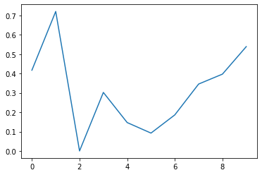
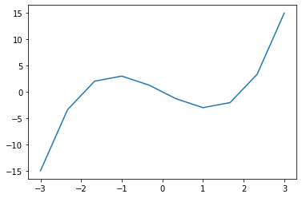
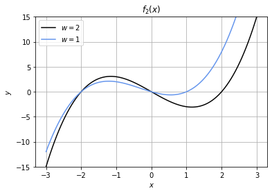
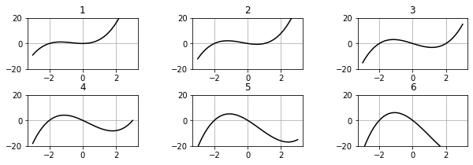
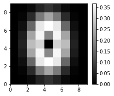
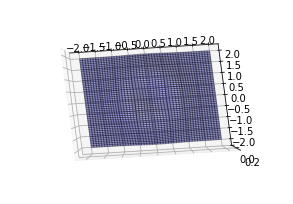
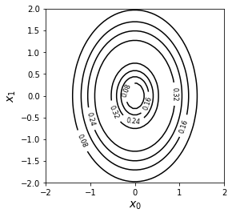

#20171622 박건후 과제 #3

## 소감
- [x] 그래프를 시각화 하는데 있어서 다양한 옵션들을 사용해볼 수 있었습니다.
- [x] 그래프의 다양한 형태를 나타내는 코드를 작성함으로써 그래프를 어떻게 표현할지 생각할 수 있었습니다. 
- [x] 행렬 연산을 파이썬으로 어떻게 처리하는지 알게 되었습니다. .
- [x] np.linspace 를 통해 구간을 나눠 함수에 값을 넘기는 방법으로 그래프를 시각화할 수 있었습니다.


## Chapter2 파이썬 기본
```python
import numpy as np
```


```python
x=np.array([1,2,3])
x
```


    array([1, 2, 3])


```python
print(x)
```

    [1 2 3]


```python
y=np.array([4, 5, 6])
print(x + y)
```

    [5 7 9]


```python
type(x)
```


    numpy.ndarray


```python
x[0]
```


    1


```python
x[0] = 100
print(x)
```

    [100   2   3]


```python
print(np.arange(10))
```

    [0 1 2 3 4 5 6 7 8 9]


```python
print(np.arange(5, 10))
```

    [5 6 7 8 9]


```python
a = np.array([1, 1])
b = a
print('a =' + str(a))
print('b =' + str(b))
b[0] = 100
print('b =' + str(b))
print('a =' + str(a))

```

    a =[1 1]
    b =[1 1]
    b =[100   1]
    a =[100   1]


```python
a = np.array([1, 1])
b = a.copy()
print('a =' + str(a))
print('b =' + str(b))
b[0] = 100
print('b =' + str(b))
print('a =' + str(a))
```

    a =[1 1]
    b =[1 1]
    b =[100   1]
    a =[1 1]


```python
x = np.array([[1, 2, 3], [4, 5, 6]])
print(x)
```

    [[1 2 3]
     [4 5 6]]


```python
x = np.array([[1, 2, 3], [4, 5, 6]])
x.shape
```


    (2, 3)


```python
w, h = x.shape
print(w)
print(h)
```

    2
    3


```python
x = np.array([[1, 2, 3], [4, 5, 6]])
x[1, 2]
```


    6


```python
x = np.array([[1, 2, 3], [4, 5, 6]])
x[1, 2] = 100
print(x)
```

    [[  1   2   3]
     [  4   5 100]]


```python
print(np.zeros(10))
```

    [0. 0. 0. 0. 0. 0. 0. 0. 0. 0.]


```python
print(np.zeros((2, 10)))
```

    [[0. 0. 0. 0. 0. 0. 0. 0. 0. 0.]
     [0. 0. 0. 0. 0. 0. 0. 0. 0. 0.]]


```python
print(np.ones((2, 10)))
```

    [[1. 1. 1. 1. 1. 1. 1. 1. 1. 1.]
     [1. 1. 1. 1. 1. 1. 1. 1. 1. 1.]]


```python
np.random.rand(2, 3)
```


    array([[0.25647026, 0.51669507, 0.71483625],
           [0.03190799, 0.16197837, 0.47912346]])


```python
a = np.arange(10)
print(a)
```

    [0 1 2 3 4 5 6 7 8 9]


```python
a.reshape(2, 5)
```


    array([[0, 1, 2, 3, 4],
           [5, 6, 7, 8, 9]])


```python
x = np.array([[4, 4, 4], [8, 8, 8]])
y = np.array([[1, 1, 1], [2, 2, 2]])
print(x + y)
```

    [[ 5  5  5]
     [10 10 10]]


```python
x = np.array([[4, 4, 4], [8, 8, 8]])
print(10 * x)
```

    [[40 40 40]
     [80 80 80]]


```python
x = np.array([[4, 4, 4], [8, 8, 8]])
print(np.exp(x))
```

    [[  54.59815003   54.59815003   54.59815003]
     [2980.95798704 2980.95798704 2980.95798704]]


```python
v = np.array([[1, 2, 3], [4, 5, 6]])
w = np.array([[1, 1], [2, 2], [3, 3]])
print(v.dot(w))
```

    [[14 14]
     [32 32]]


```python
x = np.arange(10)
print(x)
print(x[:5])
```

    [0 1 2 3 4 5 6 7 8 9]
    [0 1 2 3 4]


```python
print(x[5:])
```

    [5 6 7 8 9]


```python
print(x[3:8])
```

    [3 4 5 6 7]


```python
print(x[3:8:2])
```

    [3 5 7]


```python
print(x[::-1])
```

    [9 8 7 6 5 4 3 2 1 0]


```python
y = np.array([[1, 2, 3], [4, 5, 6], [7, 8, 9]])
print(y)
print(y[:2, 1:2])
```

    [[1 2 3]
     [4 5 6]
     [7 8 9]]
    [[2]
     [5]]


```python
x = np.array([1, 1, 2, 3, 5, 8, 13])
x > 3
```


    array([False, False, False, False,  True,  True,  True])


```python
x[x > 3]
```


    array([ 5,  8, 13])


```python
x[x > 3] = 999
print(x)
```

    [  1   1   2   3 999 999 999]


```python
help(np.random.randint)
```

    Help on built-in function randint:
    
    randint(...) method of numpy.random.mtrand.RandomState instance
        randint(low, high=None, size=None, dtype='l')
        
        Return random integers from `low` (inclusive) to `high` (exclusive).
        
        Return random integers from the "discrete uniform" distribution of
        the specified dtype in the "half-open" interval [`low`, `high`). If
        `high` is None (the default), then results are from [0, `low`).
        
        Parameters
        ----------
        low : int or array-like of ints
            Lowest (signed) integers to be drawn from the distribution (unless
            ``high=None``, in which case this parameter is one above the
            *highest* such integer).
        high : int or array-like of ints, optional
            If provided, one above the largest (signed) integer to be drawn
            from the distribution (see above for behavior if ``high=None``).
            If array-like, must contain integer values
        size : int or tuple of ints, optional
            Output shape.  If the given shape is, e.g., ``(m, n, k)``, then
            ``m * n * k`` samples are drawn.  Default is None, in which case a
            single value is returned.
        dtype : dtype, optional
            Desired dtype of the result. All dtypes are determined by their
            name, i.e., 'int64', 'int', etc, so byteorder is not available
            and a specific precision may have different C types depending
            on the platform. The default value is 'np.int'.
        
            .. versionadded:: 1.11.0
        
        Returns
        -------
        out : int or ndarray of ints
            `size`-shaped array of random integers from the appropriate
            distribution, or a single such random int if `size` not provided.
        
        See Also
        --------
        random.random_integers : similar to `randint`, only for the closed
            interval [`low`, `high`], and 1 is the lowest value if `high` is
            omitted.
        
        Examples
        --------
        >>> np.random.randint(2, size=10)
        array([1, 0, 0, 0, 1, 1, 0, 0, 1, 0]) # random
        >>> np.random.randint(1, size=10)
        array([0, 0, 0, 0, 0, 0, 0, 0, 0, 0])
        
        Generate a 2 x 4 array of ints between 0 and 4, inclusive:
        
        >>> np.random.randint(5, size=(2, 4))
        array([[4, 0, 2, 1], # random
               [3, 2, 2, 0]])
        
        Generate a 1 x 3 array with 3 different upper bounds
        
        >>> np.random.randint(1, [3, 5, 10])
        array([2, 2, 9]) # random
        
        Generate a 1 by 3 array with 3 different lower bounds
        
        >>> np.random.randint([1, 5, 7], 10)
        array([9, 8, 7]) # random
        
        Generate a 2 by 4 array using broadcasting with dtype of uint8
        
        >>> np.random.randint([1, 3, 5, 7], [[10], [20]], dtype=np.uint8)
        array([[ 8,  6,  9,  7], # random
               [ 1, 16,  9, 12]], dtype=uint8)


```python
def my_func1():
 print('Hi!')
#함수 my_func1()의 정의는 여기까지
my_func1() # 함수를 실행
```

    Hi!


```python
def my_func2(a, b):
 c = a + b
 return c
my_func2(1, 2)
```


    3


```python
def my_func3(D):
 m = np.mean(D)
 s = np.std(D)
 return m, s
```


```python
data=np.random.randn(100)
data_mean, data_std = my_func3(data)
print('mean:{0:3.2f}, std:{1:3.2f}'.format(data_mean, data_std))
```

    mean:-0.05, std:1.06


```python
output = my_func3(data)
print(output)
print(type(output))
print('mean:{0:3.2f}, std:{1:3.2f}'.format(output[0], output[1]))
```

    (-0.047595112121357926, 1.061576100289024)
    <class 'tuple'>
    mean:-0.05, std:1.06


```python
data = np.random.randn(5)
print(data)
np.save('datafile.npy', data) # 세이브
data = [] # 데이터 삭제
print(data)
data = np.load('datafile.npy') # 로드
print(data)
```

    [ 0.22345989 -0.08648462  1.01211478 -0.76871645  0.93578817]
    []
    [ 0.22345989 -0.08648462  1.01211478 -0.76871645  0.93578817]


```python
data1 = np.array([1, 2, 3])
data2 = np.array([10, 20, 30])
np.savez('datafile2.npz', data1=data1, data2=data2) # 세이브
data1 = [] # 데이터 삭제
data2 = []
outfile = np.load('datafile2.npz') # 로드
print(outfile.files) # 저장된 데이터 표시
data1 = outfile['data1'] # data1 꺼내기
data2 = outfile['data2'] # data2 꺼내기
print(data1)
print(data2)
```

    ['data1', 'data2']
    [1 2 3]
    [10 20 30]


## Chapter3 그래프 그리기

```python
# 리스트 1-(1)
import numpy as np
import matplotlib.pyplot as plt
%matplotlib inline
# data 작성
np.random.seed(1) # 난수를 고정
x = np.arange(10)
y = np.random.rand(10)
# 그래프 표시
plt.plot(x, y) # 꺾은선 그래프를 등록
plt.show() # 그래프 그리기
```





```python
%reset
```

    Once deleted, variables cannot be recovered. Proceed (y/[n])? y


```python
# 리스트 2-(1)
import numpy as np
import matplotlib.pyplot as plt
%matplotlib inline
def f(x):
 return (x - 2) * x * (x + 2)
```


```python
print(f(1))
```

    -3


```python
# 리스트 2-(3)
print(f(np.array([1, 2, 3])))
```

    [-3  0 15]


```python
# 리스트 2-(4)
x = np.arange(-3, 3.5, 0.5)
print(x)
```

    [-3.  -2.5 -2.  -1.5 -1.  -0.5  0.   0.5  1.   1.5  2.   2.5  3. ]


```python
# 리스트 2-(5)
x = np.linspace(-3, 3, 10)
print(np.round(x, 2))
```

    [-3.   -2.33 -1.67 -1.   -0.33  0.33  1.    1.67  2.33  3.  ]


```python
# 리스트 2-(6)
plt.plot(x, f(x))
plt.show()
```





```python
# 리스트 2-(7)
# 함수를 정의
def f2(x, w):
 return (x - w) * x * (x + 2) # (A) 함수 정의
# x를 정의
x = np.linspace(-3, 3, 100) # (B) x를 100 분할하기
# 차트 묘사
plt.plot(x, f2(x, 2), color='black', label='$w=2$') #(C)
plt.plot(x, f2(x, 1), color='cornflowerblue',
 label='$w=1$') #(D)
plt.legend(loc="upper left") # (E) 범례 표시
plt.ylim(-15, 15) # (F) y 축의 범위
plt.title('$f_2(x)$') # (G) 제목
plt.xlabel('$x$') # (H) x 라벨
plt.ylabel('$y$') # (I) y 라벨
plt.grid(True) # (J) 그리드
plt.show()
```





```python
# 리스트 2-(8)
import matplotlib
matplotlib.colors.cnames
```


    {'aliceblue': '#F0F8FF',
     'antiquewhite': '#FAEBD7',
     'aqua': '#00FFFF',
     'aquamarine': '#7FFFD4',
     'azure': '#F0FFFF',
     'beige': '#F5F5DC',
     'bisque': '#FFE4C4',
     'black': '#000000',
     'blanchedalmond': '#FFEBCD',
     'blue': '#0000FF',
     'blueviolet': '#8A2BE2',
     'brown': '#A52A2A',
     'burlywood': '#DEB887',
     'cadetblue': '#5F9EA0',
     'chartreuse': '#7FFF00',
     'chocolate': '#D2691E',
     'coral': '#FF7F50',
     'cornflowerblue': '#6495ED',
     'cornsilk': '#FFF8DC',
     'crimson': '#DC143C',
     'cyan': '#00FFFF',
     'darkblue': '#00008B',
     'darkcyan': '#008B8B',
     'darkgoldenrod': '#B8860B',
     'darkgray': '#A9A9A9',
     'darkgreen': '#006400',
     'darkgrey': '#A9A9A9',
     'darkkhaki': '#BDB76B',
     'darkmagenta': '#8B008B',
     'darkolivegreen': '#556B2F',
     'darkorange': '#FF8C00',
     'darkorchid': '#9932CC',
     'darkred': '#8B0000',
     'darksalmon': '#E9967A',
     'darkseagreen': '#8FBC8F',
     'darkslateblue': '#483D8B',
     'darkslategray': '#2F4F4F',
     'darkslategrey': '#2F4F4F',
     'darkturquoise': '#00CED1',
     'darkviolet': '#9400D3',
     'deeppink': '#FF1493',
     'deepskyblue': '#00BFFF',
     'dimgray': '#696969',
     'dimgrey': '#696969',
     'dodgerblue': '#1E90FF',
     'firebrick': '#B22222',
     'floralwhite': '#FFFAF0',
     'forestgreen': '#228B22',
     'fuchsia': '#FF00FF',
     'gainsboro': '#DCDCDC',
     'ghostwhite': '#F8F8FF',
     'gold': '#FFD700',
     'goldenrod': '#DAA520',
     'gray': '#808080',
     'green': '#008000',
     'greenyellow': '#ADFF2F',
     'grey': '#808080',
     'honeydew': '#F0FFF0',
     'hotpink': '#FF69B4',
     'indianred': '#CD5C5C',
     'indigo': '#4B0082',
     'ivory': '#FFFFF0',
     'khaki': '#F0E68C',
     'lavender': '#E6E6FA',
     'lavenderblush': '#FFF0F5',
     'lawngreen': '#7CFC00',
     'lemonchiffon': '#FFFACD',
     'lightblue': '#ADD8E6',
     'lightcoral': '#F08080',
     'lightcyan': '#E0FFFF',
     'lightgoldenrodyellow': '#FAFAD2',
     'lightgray': '#D3D3D3',
     'lightgreen': '#90EE90',
     'lightgrey': '#D3D3D3',
     'lightpink': '#FFB6C1',
     'lightsalmon': '#FFA07A',
     'lightseagreen': '#20B2AA',
     'lightskyblue': '#87CEFA',
     'lightslategray': '#778899',
     'lightslategrey': '#778899',
     'lightsteelblue': '#B0C4DE',
     'lightyellow': '#FFFFE0',
     'lime': '#00FF00',
     'limegreen': '#32CD32',
     'linen': '#FAF0E6',
     'magenta': '#FF00FF',
     'maroon': '#800000',
     'mediumaquamarine': '#66CDAA',
     'mediumblue': '#0000CD',
     'mediumorchid': '#BA55D3',
     'mediumpurple': '#9370DB',
     'mediumseagreen': '#3CB371',
     'mediumslateblue': '#7B68EE',
     'mediumspringgreen': '#00FA9A',
     'mediumturquoise': '#48D1CC',
     'mediumvioletred': '#C71585',
     'midnightblue': '#191970',
     'mintcream': '#F5FFFA',
     'mistyrose': '#FFE4E1',
     'moccasin': '#FFE4B5',
     'navajowhite': '#FFDEAD',
     'navy': '#000080',
     'oldlace': '#FDF5E6',
     'olive': '#808000',
     'olivedrab': '#6B8E23',
     'orange': '#FFA500',
     'orangered': '#FF4500',
     'orchid': '#DA70D6',
     'palegoldenrod': '#EEE8AA',
     'palegreen': '#98FB98',
     'paleturquoise': '#AFEEEE',
     'palevioletred': '#DB7093',
     'papayawhip': '#FFEFD5',
     'peachpuff': '#FFDAB9',
     'peru': '#CD853F',
     'pink': '#FFC0CB',
     'plum': '#DDA0DD',
     'powderblue': '#B0E0E6',
     'purple': '#800080',
     'rebeccapurple': '#663399',
     'red': '#FF0000',
     'rosybrown': '#BC8F8F',
     'royalblue': '#4169E1',
     'saddlebrown': '#8B4513',
     'salmon': '#FA8072',
     'sandybrown': '#F4A460',
     'seagreen': '#2E8B57',
     'seashell': '#FFF5EE',
     'sienna': '#A0522D',
     'silver': '#C0C0C0',
     'skyblue': '#87CEEB',
     'slateblue': '#6A5ACD',
     'slategray': '#708090',
     'slategrey': '#708090',
     'snow': '#FFFAFA',
     'springgreen': '#00FF7F',
     'steelblue': '#4682B4',
     'tan': '#D2B48C',
     'teal': '#008080',
     'thistle': '#D8BFD8',
     'tomato': '#FF6347',
     'turquoise': '#40E0D0',
     'violet': '#EE82EE',
     'wheat': '#F5DEB3',
     'white': '#FFFFFF',
     'whitesmoke': '#F5F5F5',
     'yellow': '#FFFF00',
     'yellowgreen': '#9ACD32'}


```python
# 리스트 2-(9)
plt.figure(figsize=(10, 3)) # (A) figure 지정
plt.subplots_adjust(wspace=0.5, hspace=0.5) # (B) 그래프의 간격을 지정
for i in range(6):
 plt.subplot(2, 3, i + 1) # (C) 그래프 묘사의 위치를 지정
 plt.title(i + 1)
 plt.plot(x, f2(x, i), 'k')
 plt.ylim(-20, 20)
 plt.grid(True)
plt.show()
```





```python
# 리스트 3-(1)
import numpy as np
import matplotlib.pyplot as plt
# 함수 f3을 정의
def f3(x0, x1):
 r = 2 * x0**2 + x1**2
 ans = r * np.exp(-r)
 return ans
# x0, x1에서 각각 f3을 계산
xn = 9
x0 = np.linspace(-2, 2, xn) # (A)
x1 = np.linspace(-2, 2, xn) # (B)
y = np.zeros((len(x0), len(x1))) # (C)
for i0 in range(xn):
 for i1 in range(xn):
     y[i1, i0] = f3(x0[i0], x1[i1]) # (D)
```


```python
print(x0)
```

    [-2.  -1.5 -1.  -0.5  0.   0.5  1.   1.5  2. ]


```python
print(np.round(y, 1))
```

    [[0.  0.  0.  0.  0.1 0.  0.  0.  0. ]
     [0.  0.  0.1 0.2 0.2 0.2 0.1 0.  0. ]
     [0.  0.  0.1 0.3 0.4 0.3 0.1 0.  0. ]
     [0.  0.  0.2 0.4 0.2 0.4 0.2 0.  0. ]
     [0.  0.  0.3 0.3 0.  0.3 0.3 0.  0. ]
     [0.  0.  0.2 0.4 0.2 0.4 0.2 0.  0. ]
     [0.  0.  0.1 0.3 0.4 0.3 0.1 0.  0. ]
     [0.  0.  0.1 0.2 0.2 0.2 0.1 0.  0. ]
     [0.  0.  0.  0.  0.1 0.  0.  0.  0. ]]


```python
# 리스트 3-(4)
plt.figure(figsize=(3.5, 3))
plt.gray() # (A)
plt.pcolor(y) # (B)
plt.colorbar() # (C)
plt.show()
```





```python
#리스트 3-(5)
from mpl_toolkits.mplot3d import Axes3D # (A)
xx0, xx1 = np.meshgrid(x0, x1) # (B)
plt.figure(figsize=(5, 3.5))
ax = plt.subplot(1, 1, 1, projection='3d') # (C)
ax.plot_surface(xx0, xx1, y, rstride=1, cstride=1, alpha=0.3,
 color='blue', edgecolor='black') # (D)
ax.set_zticks((0, 0.2)) # (E)
ax.view_init(90, -95) # (F)
plt.show()
```





```python
print(x0)
print(x1)
```

    [-2.  -1.5 -1.  -0.5  0.   0.5  1.   1.5  2. ]
    [-2.  -1.5 -1.  -0.5  0.   0.5  1.   1.5  2. ]


```python
print(xx0)
```

    [[-2.  -1.5 -1.  -0.5  0.   0.5  1.   1.5  2. ]
     [-2.  -1.5 -1.  -0.5  0.   0.5  1.   1.5  2. ]
     [-2.  -1.5 -1.  -0.5  0.   0.5  1.   1.5  2. ]
     [-2.  -1.5 -1.  -0.5  0.   0.5  1.   1.5  2. ]
     [-2.  -1.5 -1.  -0.5  0.   0.5  1.   1.5  2. ]
     [-2.  -1.5 -1.  -0.5  0.   0.5  1.   1.5  2. ]
     [-2.  -1.5 -1.  -0.5  0.   0.5  1.   1.5  2. ]
     [-2.  -1.5 -1.  -0.5  0.   0.5  1.   1.5  2. ]
     [-2.  -1.5 -1.  -0.5  0.   0.5  1.   1.5  2. ]]


```python
print(xx1)
```

    [[-2.  -2.  -2.  -2.  -2.  -2.  -2.  -2.  -2. ]
     [-1.5 -1.5 -1.5 -1.5 -1.5 -1.5 -1.5 -1.5 -1.5]
     [-1.  -1.  -1.  -1.  -1.  -1.  -1.  -1.  -1. ]
     [-0.5 -0.5 -0.5 -0.5 -0.5 -0.5 -0.5 -0.5 -0.5]
     [ 0.   0.   0.   0.   0.   0.   0.   0.   0. ]
     [ 0.5  0.5  0.5  0.5  0.5  0.5  0.5  0.5  0.5]
     [ 1.   1.   1.   1.   1.   1.   1.   1.   1. ]
     [ 1.5  1.5  1.5  1.5  1.5  1.5  1.5  1.5  1.5]
     [ 2.   2.   2.   2.   2.   2.   2.   2.   2. ]]


```python
# 리스트 3-(9)
xn = 50
x0 = np.linspace(-2, 2, xn)
x1 = np.linspace(-2, 2, xn)
y = np.zeros((len(x0), len(x1)))
for i0 in range(xn):
 for i1 in range(xn):
     y[i1, i0] = f3(x0[i0], x1[i1])

xx0, xx1 = np.meshgrid(x0, x1) # (A)
plt.figure(1, figsize=(4, 4))
cont = plt.contour(xx0, xx1, y, 5, colors='black') # (B)
cont.clabel(fmt='%3.2f', fontsize=8) # (C)
plt.xlabel('$x_0$', fontsize=14)
plt.ylabel('$x_1$', fontsize=14)
plt.show()
```




