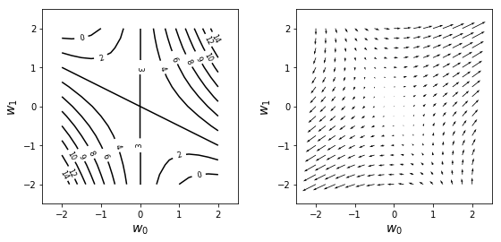
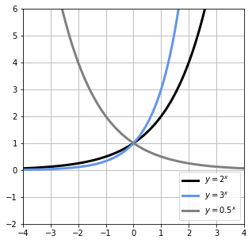
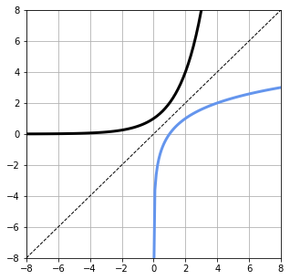
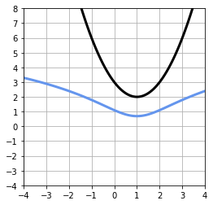
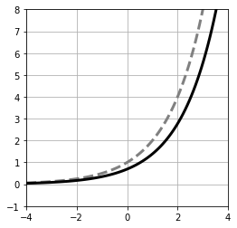
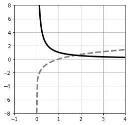
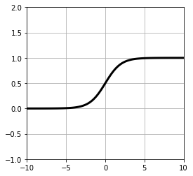
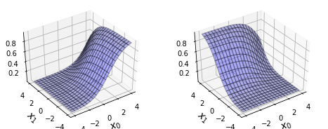
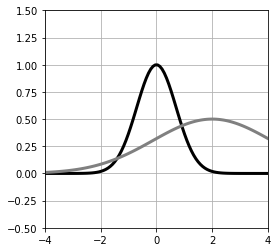
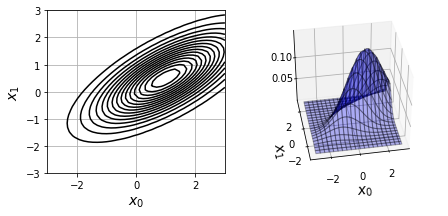

#20171622 박건후 과제 #4

## 소감
- [x] 등고선을 나타냄으로써 편미분의 정의와 기하학적 의미를 알게 되었습니다.
- [x] 그래프의 다양한 형태를 나타내는 코드를 작성함으로써 그래프를 어떻게 표현할지 생각할 수 있었습니다. 
- [x] 행렬의 사칙연산과 파이썬으로 표현하는 방법, 계산하는 방법을 알게 되었습니다.
- [x] 소프트맥스와 시그모이드 함수의 형태와 표현 방법을 알게 되었습니다.


## Chapter4 머신러닝에 필요한 수학의 기본
```python
# 리스트 4-1-(1)
import numpy as np

```


```python
# 리스트 4-1-(2)
a=np.array([2,1])
print(a)

```

    [2 1]


```python
# 리스트 4-1-(3)
type(a)

```


    numpy.ndarray


```python
# 리스트 4-1-(4)
c=np.array([[1,2],[3,4]])
print(c)

```

    [[1 2]
     [3 4]]


```python
# 리스트 4-1-(5)
d=np.array([[1],[2]])
print(d)

```

    [[1]
     [2]]


```python
# 리스트 4-1-(6)
print(d.T)

```

    [[1 2]]


```python
# 리스트 4-1-(7)
a = np.array([2, 1])
b = np.array([1, 3])
print(a + b)

```

    [3 4]


```python
# 리스트 4-1-(8)
a = np.array([2, 1])
b = np.array([1, 3])
print(a - b)

```

    [ 1 -2]


```python
# 리스트 4-1-(9)
print(2 * a)

```

    [4 2]


```python
# 리스트 4-1-(10)
b = np.array([1, 3])
c = np.array([4, 2])
print(b.dot(c))

```

    10


```python
# 리스트 4-1-(11)
a = np.array([1, 3])
print(np.linalg.norm(a))

```

    3.1622776601683795


```python
# 리스트 4-2-(1)
import numpy as np
a = np.ones(1000) # [1 1 1 ... 1]
b = np.arange(1,1001) # [1 2 3 ... 1000]
print(a.dot(b))

```

    500500.0


```python
# 리스트 4-2-(2)
import numpy as np
import matplotlib.pyplot as plt

def f(w0, w1): # (A) f의 정의
    return w0**2 + 2 * w0 * w1 + 3
def df_dw0(w0, w1): # (B) f의 w0에 관한 편미분
    return 2 * w0 + 2 * w1
def df_dw1(w0, w1): # (C) f의 w1에 관한 편미분
    return 2 * w0 + 0 * w1


w_range = 2
dw = 0.25
w0 = np.arange(-w_range, w_range + dw, dw)
w1 = np.arange(-w_range, w_range + dw, dw)
wn = w0.shape[0]
ww0, ww1 = np.meshgrid(w0, w1) # (D)
ff = np.zeros((len(w0), len(w1)))
dff_dw0 = np.zeros((len(w0), len(w1)))
dff_dw1 = np.zeros((len(w0), len(w1)))
for i0 in range(wn): # (E)
    for i1 in range(wn):
        ff[i1, i0] = f(w0[i0], w1[i1])
        dff_dw0[i1, i0] = df_dw0(w0[i0], w1[i1])
        dff_dw1[i1, i0] = df_dw1(w0[i0], w1[i1])
        
plt.figure(figsize=(9, 4))
plt.subplots_adjust(wspace=0.3)
plt.subplot(1, 2, 1)
cont = plt.contour(ww0, ww1, ff, 10, colors='k') # (F) f의 등고선 표시
cont.clabel(fmt='%2.0f', fontsize=8)
plt.xticks(range(-w_range, w_range + 1, 1))
plt.yticks(range(-w_range, w_range + 1, 1))
plt.xlim(-w_range - 0.5, w_range + .5)
plt.ylim(-w_range - .5, w_range + .5)
plt.xlabel('$w_0$', fontsize=14)
plt.ylabel('$w_1$', fontsize=14)


plt.subplot(1, 2, 2)
plt.quiver(ww0, ww1, dff_dw0, dff_dw1) # (G) f의 경사 벡터 표시
plt.xlabel('$w_0$', fontsize=14)
plt.ylabel('$w_1$', fontsize=14)
plt.xticks(range(-w_range, w_range + 1, 1))
plt.yticks(range(-w_range, w_range + 1, 1))
plt.xlim(-w_range - 0.5, w_range + .5)
plt.ylim(-w_range - .5, w_range + .5)
plt.show()
```





```python
# 리스트 4-3-(1)
import numpy as np

```


```python
# 리스트 4-3-(2)
A=np.array([[1, 2, 3], [4, 5, 6]])
print(A)

```

    [[1 2 3]
     [4 5 6]]


```python
# 리스트 4-3-(3)
B = np.array([[7, 8, 9], [10, 11, 12]])
print(B)

```

    [[ 7  8  9]
     [10 11 12]]


```python
# 리스트 4-3-(4)
print(A + B)
print(A - B)

```

    [[ 8 10 12]
     [14 16 18]]
    [[-6 -6 -6]
     [-6 -6 -6]]


```python
# 리스트 4-3-(6)
A=np.array([1, 2, 3])
B=np.array([4, 5, 6])
print(A.dot(B))

```

    32


```python
# 리스트 4-3-(7)
A = np.array([1, 2, 3])
B = np.array([4, 5, 6])
print(A * B)

```

    [ 4 10 18]


```python
# 리스트 4-3-(8)
A = np.array([1, 2, 3])
B = np.array([4, 5, 6])
print(A / B)

```

    [0.25 0.4  0.5 ]


```python
# 리스트 4-3-(9)
A = np.array([[1, 2, 3], [-1, -2, -3]])
B = np.array([[4, -4], [5, -5], [6, -6]])
print(A.dot(B))

```

    [[ 32 -32]
     [-32  32]]


```python
# 리스트 4-3-(10)
print(np.identity(3))

```

    [[1. 0. 0.]
     [0. 1. 0.]
     [0. 0. 1.]]


```python
# 리스트 4-3-(11)
A = np.array([[1, 2, 3], [4, 5, 6], [7, 8, 9]])
I = np.identity(3)
print(A.dot(I))

```

    [[1. 2. 3.]
     [4. 5. 6.]
     [7. 8. 9.]]


```python
# 리스트 4-3-(12)
A=np.array([[1, 2],[3, 4]])
invA = np.linalg.inv(A)
print(invA)

```

    [[-2.   1. ]
     [ 1.5 -0.5]]


```python
# 리스트 4-3-(13)
A = np.array([[1, 2, 3], [4, 5, 6]])
print(A)
print(A.T)

```

    [[1 2 3]
     [4 5 6]]
    [[1 4]
     [2 5]
     [3 6]]


```python
# 리스트 4-4-(1)
import numpy as np
import matplotlib.pyplot as plt
%matplotlib inline
x = np.linspace(-4, 4, 100)
y = 2**x
y2 = 3**x
y3 = 0.5**x


plt.figure(figsize=(5, 5))
plt.plot(x, y, 'black', linewidth=3, label='$y=2^x$')
plt.plot(x, y2, 'cornflowerblue', linewidth=3, label='$y=3^x$')
plt.plot(x, y3, 'gray', linewidth=3, label='$y=0.5^x$')
plt.ylim(-2, 6)
plt.xlim(-4, 4)
plt.grid(True)
plt.legend(loc='lower right')
plt.show()

```





```python
# 리스트 4-4-(2)
x = np.linspace(-8, 8, 100)
y = 2**x


x2 = np.linspace (0.001, 8, 100) # np.log(0)는 에러가 되므로 0은 포함하지 않음
y2 = np.log (x2) / np.log (2) # 밑을 2로 한 log를 공식(7)로 계산
plt.figure(figsize=(5, 5))
plt.plot(x, y, 'black', linewidth=3)
plt.plot(x2, y2, 'cornflowerblue', linewidth=3)
plt.plot(x, x, 'black', linestyle='--', linewidth=1)
plt.ylim(-8, 8)
plt.xlim(-8, 8)
plt.grid(True)
plt.show()

```





```python
# 리스트 4-4-(3)
x = np.linspace(-4, 4, 100)
y = (x - 1)**2 + 2
logy = np.log(y)


plt.figure(figsize=(4, 4))
plt.plot(x, y, 'black', linewidth=3)
plt.plot(x, logy, 'cornflowerblue', linewidth=3)
plt.yticks(range(-4,9,1))
plt.xticks(range(-4,5,1))
plt.ylim(-4, 8)
plt.xlim(-4, 4)
plt.grid(True)
plt.show()

```





```python
# 리스트 4-4-(4)
x = np.linspace(-4, 4, 100)
a = 2 # 이 값을 여러가지로 바꿔 보자
y = a**x
dy = np.log(a) * y


plt.figure(figsize=(4, 4))
plt.plot(x, y, 'gray', linestyle='--', linewidth=3)
plt.plot(x, dy, color='black', linewidth=3)
plt.ylim(-1, 8)
plt.xlim(-4, 4)
plt.grid(True)
plt.show()

```





```python
# 리스트 4-4-(5)
x = np.linspace (0.0001, 4, 100) # 0 이하로 정의할 수 없는
y = np.log(x)
dy = 1 / x

plt.figure(figsize=(4, 4))
plt.plot(x, y, 'gray', linestyle='--', linewidth=3)
plt.plot(x, dy, color='black', linewidth=3)
plt.ylim(-8, 8)
plt.xlim(-1, 4)
plt.grid(True)
plt.show()

```





```python
# 리스트 4-4-(6)
x = np.linspace(-10, 10, 100)
y = 1 / (1 + np.exp(-x))

plt.figure(figsize=(4, 4))
plt.plot(x, y, 'black', linewidth=3)

plt.ylim(-1, 2)
plt.xlim(-10, 10)
plt.grid(True)
plt.show()

```





```python
# 리스트 4-4-(7)
def softmax(x0, x1, x2):
    u = np.exp(x0) + np.exp(x1) + np.exp(x2)
    return np.exp(x0) / u, np.exp(x1) / u, np.exp(x2) / u 


# test
y = softmax(2, 1, -1)
print(np.round (y, 2)) # (A) 소수점 2 자리로 최대한 가깝게 표시
print(np.sum (y)) # (B) 합계를 표시

```

    [0.71 0.26 0.04]
    1.0


```python
# 리스트 4-4-(8)


from mpl_toolkits.mplot3d import Axes3D


xn = 20
x0 = np.linspace(-4, 4, xn)
x1 = np.linspace(-4, 4, xn)

y = np.zeros((xn, xn, 3))
for i0 in range(xn):
    for i1 in range(xn):
        y[i1, i0, :] = softmax(x0[i0], x1[i1], 1)
        
        
xx0, xx1 = np.meshgrid(x0, x1)
plt.figure(figsize=(8, 3))
for i in range(2):
    ax = plt.subplot(1, 2, i + 1, projection='3d')
    ax.plot_surface(xx0, xx1, y[:, :, i],
                    rstride=1, cstride=1, alpha=0.3,
                    color='blue', edgecolor='black')
    ax.set_xlabel('$x_0$', fontsize=14)
    ax.set_ylabel('$x_1$', fontsize=14)
    ax.view_init(40, -125)
    
    
    
plt.show()

```





```python
# 리스트 4-4-(9)
def gauss(mu, sigma, a):
    return a * np.exp(-(x - mu)**2 / sigma**2)


x = np.linspace(-4, 4, 100)
plt.figure(figsize=(4, 4))
plt.plot(x, gauss(0, 1, 1), 'black', linewidth=3)
plt.plot(x, gauss(2, 3, 0.5), 'gray', linewidth=3)
plt.ylim(-.5, 1.5)
plt.xlim(-4, 4)
plt.grid(True)
plt.show()

```





```python
# 리스트 4-5-(1)
import numpy as np
import matplotlib.pyplot as plt
from mpl_toolkits.mplot3d import axes3d
%matplotlib inline


# 가우스 함수
def gauss(x, mu, sigma):
    N, D = x.shape
    c1 = 1 / (2 * np.pi)**(D / 2)
    c2 = 1 / (np.linalg.det(sigma)**(1 / 2))
    inv_sigma = np.linalg.inv(sigma)
    c3 = x - mu
    c4 = np.dot(c3, inv_sigma)
    c5 = np.zeros(N)
    for d in range(D):
        c5 = c5 + c4[:, d] * c3[:, d]
    p = c1 * c2 * np.exp(-c5 / 2)
    return p

```


```python
# 리스트 4-5-(2)
x = np.array([[1, 2], [2, 1], [3, 4]])
mu = np.array([1, 2])
sigma = np.array([[1, 0], [0, 1]])
print(gauss(x, mu, sigma))

```

    [0.15915494 0.05854983 0.00291502]


```python
# 리스트 4-5-(3)
X_range0=[-3,3]
X_range1=[-3,3]


# 등고선 표시 --------------------------------
def show_contour_gauss(mu, sig):
    xn = 40 # 등고선 표시 해상도
    x0 = np.linspace(X_range0[0], X_range0[1], xn)
    x1 = np.linspace(X_range1[0], X_range1[1], xn)
    xx0, xx1 = np.meshgrid(x0, x1)
    x = np.c_[np.reshape(xx0, xn * xn, 1), np.reshape(xx1, xn * xn, 1)]
    f = gauss(x, mu, sig)
    f = f.reshape(xn, xn)
    f = f.T
    cont = plt.contour(xx0, xx1, f, 15, colors='k')
    plt.grid(True)

# 3D 표시 ----------------------------------
def show3d_gauss(ax, mu, sig):
    xn = 40 # 등고선 표시 해상도
    x0 = np.linspace(X_range0[0], X_range0[1], xn)
    x1 = np.linspace(X_range1[0], X_range1[1], xn)
    xx0, xx1 = np.meshgrid(x0, x1)
    x = np.c_[np.reshape(xx0, xn * xn, 1), np.reshape(xx1, xn * xn, 1)]
    f = gauss(x, mu, sig)
    f = f.reshape(xn, xn)
    f = f.T
    ax.plot_surface(xx0, xx1, f,
                    rstride=2, cstride=2, alpha=0.3,
                    color='blue', edgecolor='black')

# 메인 -----------------------------------
mu = np.array([1, 0.5]) # (A)
sigma = np.array([[2, 1], [1, 1]]) # (B)
Fig = plt.figure(1, figsize=(7, 3))
Fig.add_subplot(1, 2, 1)
show_contour_gauss(mu, sigma)
plt.xlim(X_range0)
plt.ylim(X_range1)
plt.xlabel('$x_0$', fontsize=14)
plt.ylabel('$x_1$', fontsize=14)
Ax = Fig.add_subplot(1, 2, 2, projection='3d')
show3d_gauss(Ax, mu, sigma)
Ax.set_zticks([0.05, 0.10])
Ax.set_xlabel('$x_0$', fontsize=14)
Ax.set_ylabel('$x_1$', fontsize=14)
Ax.view_init(40, -100)
plt.show()

```




